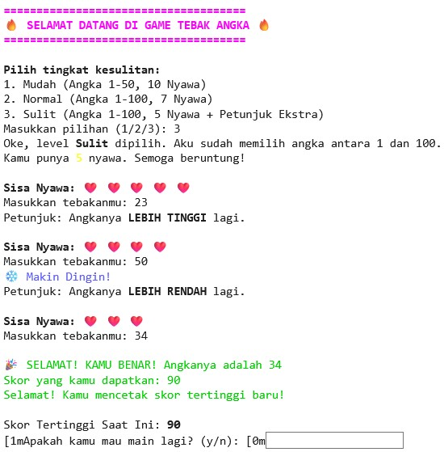

# 🔥 Game Tebak Angka Sederhana

Sebuah game tebak angka sederhana yang dibuat dengan Python, namun dengan fitur-fitur modern untuk pengalaman bermain yang lebih seru. Proyek ini dibuat untuk menunjukkan penguasaan logika fundamental Python.

## ✨ Fitur Pada Program

- **Tiga Tingkat Kesulitan**: Pilih antara Mudah, Normal, dan Sulit yang memengaruhi rentang angka dan jumlah nyawa.
- **Petunjuk Cerdas**: Dapatkan petunjuk "Makin Panas 🔥" atau "Makin Dingin ❄️" berdasarkan kedekatan tebakanmu.
- **Sistem Skor**: Skor dihitung berdasarkan sisa nyawa dan tingkat kesulitan yang dipilih.
- **Tampilan Terminal Modern**: Antarmuka yang bersih dengan pewarnaan untuk membedakan status dan petunjuk.
- **Skor Tertinggi**: Program akan mengingat skor tertinggimu selama sesi permainan.

## 📸 Tangkapan Layar



## 🚀 Cara Menjalankan

1. Pastikan kamu sudah menginstall Python 3.
2. Clone repository ini:
   ```bash
   git clone [https://github.com/NAMA_USER_KAMU/NAMA_REPO_KAMU.git](https://github.com/NAMA_USER_KAMU/NAMA_REPO_KAMU.git)
   ```
3. Masuk ke direktori proyek:
   ```bash
   cd game-tebak-angka
   ```
4. Jalankan game:
   ```bash
   python game.py
   ```

## 💻 Teknologi yang Digunakan
- Python 3
